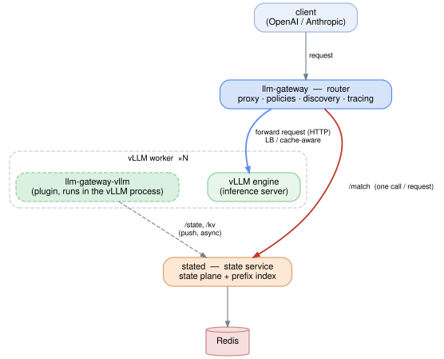

# llm-gateway

[English](README.md) | **中文**

一个**引擎无关、状态感知**的 LLM 推理网关：OpenAI/Anthropic 兼容的 router +
**可选**的引擎插件 + 可插拔的状态层。

> **“装了插件就高保真，不装也能跑；单实例省依赖，集群自动共享状态。”**

## 架构



*源文件：[`docs/architecture.dot`](docs/architecture.dot) —— 用
`dot -Tsvg docs/architecture.dot -o docs/architecture.svg` 重新生成。*

- **`llm-gateway`** —— router：代理 + 策略 + 服务发现 + 健康 + 追踪。**无状态**，可任意多副本。
- **`llm-gateway-vllm`** —— 可选引擎插件：把负载/会话状态上报到 `/state`、每块 KV 事件上报到 `/kv`，
  并提供 block-hash 端点。
- **`stated`** —— 集群里的**共享状态服务**：前置 Redis，同时管**状态面**与前缀索引。router 和插件
  只跟它打交道，**不直连 Redis**。
- **Redis** —— `stated` 背后的持久存储。

**单实例模式不需要中间这层**——router 自己跑，进程内状态、无 Redis。

## 为什么

现有 router 大多只做**近似**：

- **Rust 网关**（`vllm-project/router`、`sgl-model-gateway`）——负载均衡很强，但 KV
  感知是**近似**（按路由历史自建的 radix 树），且**每个 router 副本只看到一部分流量**
  → 集群内各副本视图不一致。

`llm-gateway` 来解决这些：**有真实状态就用，没有就优雅回退**；并用**共享状态层**让每个
router 副本看到一致视图。

## 快速开始

编译并在一个或多个 OpenAI 兼容后端前运行 router：

```bash
go build -o llm-gateway ./cmd/gateway
./llm-gateway --workers http://w1:8000,http://w2:8000 --policy power_of_two
# 然后把客户端指向 http://<gateway>:8000
```

策略：`round_robin`、`random`、`power_of_two`、`consistent_hash`、
`cache_aware`（router 侧近似的**前缀亲和**，无需插件）、
`least_latency`（**单一目标：最小化预估 TTFT**——把缓存省时、负载、吞吐放到同一尺度；
泛化了 cache-aware 与 least-loaded）。
请求在**所属 model 的池**内选路（worker 按 model/service 分组，见下方"服务发现"）。
端点：`/v1/*`（代理）、`/metrics`（Prometheus 文本）、`/healthz`。

### 服务发现（可插拔）

worker 由 `Discovery` 后端提供（`--discovery`）：

| 后端 | 参数 | 说明 |
|---|---|---|
| `static`（默认） | `--workers url[,url...]` 或 `model=url[,...]` | 无需基础设施 |
| `consul` | `--consul-addr` `--consul-services` | 走 catalog HTTP API，**零 SDK**；服务名即模型名 |
| `dns` | `--dns-domain` `--dns-services` | SRV `_<model>._tcp.<域>`，标准库 |
| `k8s` | `--k8s-selector` `--k8s-namespace` `--k8s-port-name` | 走 API 的 EndpointSlice（service-account），**不引 client-go** |

```bash
./llm-gateway --discovery consul \
  --consul-addr http://127.0.0.1:8500 --consul-services qwen,llama
# 或 DNS:  --discovery dns --dns-domain svc.cluster.local --dns-services qwen
# 或 k8s:  --discovery k8s --k8s-selector app=vllm --k8s-port-name http
```

### 链路追踪

把 `--otel-endpoint` 指向 OTLP/HTTP collector，每请求一个 span（`llm.model`、`llm.worker`、
status），带 W3C `traceparent` 透传：

```bash
./llm-gateway --workers http://w1:8000 \
  --otel-endpoint http://localhost:4318/v1/traces
```

### 状态存储（可插拔）

状态面是 last-value KV + watch（`--state-store`）：

| 后端 | 说明 |
|---|---|
| `inproc`（默认） | 单实例，无需基础设施 |
| `consul` | 集群模式：KV + blocking-query watch + session TTL；所有副本指向同一 Consul → **视图一致** |

```bash
./llm-gateway --discovery static --workers http://w1:8000 \
  --state-store consul --consul-addr http://127.0.0.1:8500
```

上面两个后端用于**单实例 / 简单**场景（router 自己持状态）。真正的集群里，状态面（和前缀
索引）由**状态服务**托管——见下一节。

### 集群状态：状态服务（`stated`）

集群里跑**状态服务**——它前置 Redis，同时管**状态面**（worker/会话标量）和**前缀索引**
（block hash → workers）。router 和引擎插件只跟它打交道，**不直连 Redis**（[设计 §13](docs/design.md)）：

```
plugin ──/state, /kv──►  stated  ──►  Redis
router ──/match────────────────►  stated
```

```bash
# 状态服务（一个集群一个；要多副本就起多个 + Redis Cluster 分片）
stated --redis-addrs 127.0.0.1:6379 --listen :8081

# router 集群模式
./llm-gateway --workers http://w1:8000 --policy cache_aware \
  --state-server http://stated:8081 \
  --hash-endpoint http://w1:8000/v1/chat_cache/hashing
```

- **端点**：`/state` + `/kv`（插件写：worker/会话标量、每块缓存增删）、`/match`
  ——**router 每请求只调这一个**：返回**最长前缀合并结果** + **会话的 cached tokens**
  + **候选 worker 的上报负载**。router 不持有任何本地状态。
- **请求 hash**：router 仍需每个请求的 block-hash 链——来自引擎 hashing 端点
  （`--hash-endpoint`）和/或预计算的 `--hash-header`（默认 `X-KV-Hashes`）。**插件提供该端点**：
  走 `vllm.endpoint_plugins` 的 API server 路由（新版 vLLM，精确 tokenization；用
  `VLLM_PLUGINS=llm_gateway_hashing` allowlist），或独立 hashing 服务（`LLMGATEWAY_HASH_PORT`）。

单实例（开发）不需要服务——router 走进程内。

可选——在 vLLM 侧开启真实状态上报（指向 `stated`）：

```bash
pip install ./plugins/vllm
export LLMGATEWAY_ENDPOINT=http://stated:8081/state
```

见 [`plugins/vllm/README.md`](plugins/vllm/README.md)。

## 设计

完整系统设计（架构、状态协议、策略、单实例 vs 集群模式、路线图）见
[`docs/design.md`](docs/design.md)。

## 目录

```
cmd/gateway/          Go router 入口
cmd/stated/           Go 状态服务入口（集群里前置 Redis）
internal/control/     worker 注册 + 健康（按 model 分组建池）
internal/discovery/   Discovery 接口 + static / consul
internal/policies/    Policy 接口 + round_robin/random/power_of_two/consistent_hash
internal/prefix/      倒排 block-hash 索引 + 最长前缀匹配（inproc/redis）
internal/proxy/       OpenAI/Anthropic 代理 + SSE 流式
internal/resilience/  熔断器
internal/state/       StateStore(inproc/consul) / StateProvider / 版本化 schema
internal/stateserver/ 状态服务（状态面 + 前缀索引，前置 Redis）
internal/stateclient/ router 侧的状态服务客户端
internal/otel/        最小 OTLP/HTTP 追踪 + W3C traceparent（标准库，无 SDK）
internal/observability/  Prometheus 文本指标（标准库，零依赖）
plugins/vllm/         可选 vLLM 引擎插件（Python）
```

## 状态

M1（router 数据面）、M2（router 侧缓存感知选路 + 优雅降级）、M3（真实状态上报）均已实现
并测试。worker 按 model/service 分组；服务发现（static/Consul）可插拔。

M4（设计 §13）**已实现**：倒排 block-hash 索引（[`internal/prefix`](internal/prefix)）+
热缓存 + 指数采样；**共享状态服务**（[`internal/stateserver`](internal/stateserver) +
[`cmd/stated`](cmd/stated)）前置 Redis 同时管状态面与前缀索引——router/插件只跟它打交道、
不直连 Redis；router 侧客户端（[`internal/stateclient`](internal/stateclient)）；vLLM 插件
上报每块增删并提供引擎侧 **hashing 端点**。

**尚未在真 vLLM / 真 Redis 上端到端验证**（插件与服务均单测；router 是用"进程内 Redis 的
状态服务"冒烟过的）。路线图见设计文档。

路线图见设计文档。

## 许可证

Apache-2.0（见 `LICENSE`）。
